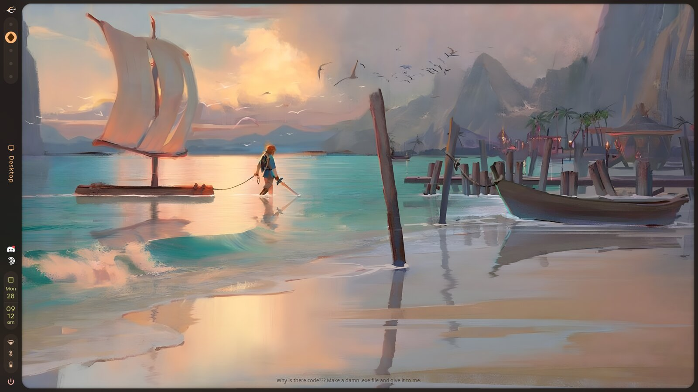

# hyprquip

hyprlands official splash texts, anywhere

hyprland puts a little splash text at the bottom of its default wallpaper, but once a shell like caelestia or serpantinum draws its own wallpaper you never see it again. hyprquip brings it back on your desktop, and can also put it in hyprlock, waybar, fastfetch or your terminal




## features

- same splash list as hyprland (`src/helpers/Splashes.hpp`), christmas and new year ones included
- sits on top of your wallpaper and under your windows, same size and spot as hyprland draws it
- works next to any shell, doesnt patch anything
- picks dark or light text depending on how bright your wallpaper is
- uses your caelestia colours if you have caelestia
- cli for scripts, bars, lock screens and greetings

## install

### arch

```sh
yay -S hyprquip-git
```

then start the desktop splash with systemd:

```sh
systemctl --user enable --now hyprquip
```

or from your hyprland config:

```lua
hl.on("hyprland.start", function() hl.exec_cmd("qs -p /usr/share/hyprquip/quickshell") end)
```

```ini
exec-once = qs -p /usr/share/hyprquip/quickshell
```

### install script

```sh
git clone https://github.com/iamanuclearwarhead/hyprquip
cd hyprquip
./install.sh
```

installs to `~/.local` and adds the autostart for you. `--system` installs to `/usr`, `--uninstall` removes everything

> the desktop splash needs [quickshell](https://quickshell.org), picking the text colour needs imagemagick. the cli only needs bash

## usage

```
hyprquip              random splash
hyprquip --session    the one hyprland picked this session
hyprquip --daily      same one all day
hyprquip --all        every splash
hyprquip --json       json for waybar
```

`HYPRQUIP_DATE=2026-12-25 hyprquip` pretends its christmas

## config

`~/.config/hyprquip/config.json`, changes apply live

```json
{
    "mode": "session",
    "tone": "auto",
    "opacity": 0.85,
    "shadow": true
}
```

- `mode` session, daily or random
- `refreshMinutes` pick a new one every n minutes, 0 to never
- `tone` auto, light or dark text
- `color` any colour like `#55ffffff` instead of auto
- `opacity`, `shadow`, `shadowColor`, `font`, `sizeDivisor`, `bottom` for the rest
- `wallpaper` wallpaper path for auto tone if you dont use caelestia

for the exact hyprland look use `{ "tone": "light", "shadow": false, "opacity": 0.333 }`

## snippets

theres ready made configs for hyprlock, waybar, fastfetch, fish, bash/zsh and a caelestia toast in [snippets](snippets)

## updating the splashes

```sh
./tools/update-splashes.py
```

## license

bsd 3-clause, see [license](LICENSE) here. the splash texts belong to hyprland and vaxerski, also bsd 3-clause, see [data/LICENSE.hyprland](data/LICENSE.hyprland). not affiliated with hyprland
